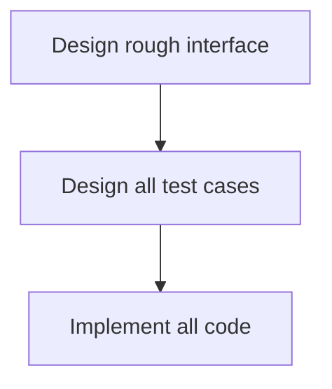
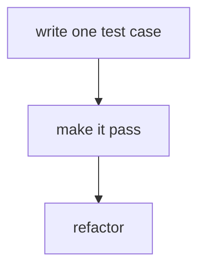

# Why and When ?

## What is unit testing for ?
1. Understanding what to build : Unit tests help understand the system and the units you are trying to build. It forces you to think carefully how the units should be used and integrated to make the whole system.
2. Documentation 
3. Design
4. Regression protection : As you expand and build more of your system, unit tests will protect against regression failures.

### Documentation 

Unit tests specify the behaviour of the unit under test in some detail. 
- What methods does it have, its signature and the results it returns.
- The test should give a good demonstration of how the original developer intended the unit to be used.
- The tests have to be in sync with the unit under test.

### Design

- Decomposition of system into testable units. 
- Design interface and implementation separately. 

## Limitations of unit testing

- It can be hard to write unit tests if units have too many dependencies. It is a sign that your design is not loosely coupled and doesn't exhibit high cohesion. 
- The unit tests might be passing but they might not be testing same scenarios as what happens in the production. You need to work hard to find test data that is relevant and make sure that the scenarios that happen in production are taken care of.
- Unit tests can't find integration errors or non-functional problems like performance or security.

## Unit testing approaches

**Test last**

In this approach, you don't start designing test cases until the design is relatively stable. While you are iterating towards a good design, you avoid having to rewrite the test cases.

This advantage is also a risk. You may find that the design of the unit you have settled on is not very testable and only discover later that you need considerable rework before you can write the tests. 

This way there is a risk of having an untestable design. You also run the risk of discovering bugs late in the process and having to do a lot of debugging and reworking. This will lead you to rush writing the tests.

**Test first**

This forces you for a testable interface. It helps you to think through all the important behaviours and cover them with test cases. This lands us in a much better position than the `test last` approach. 

But we still have this risk of rework because it is hard to predict all cases that we are going to need in advance. You will end up iterating and improving your test and your design as you go along. It might be better to accept from the start that that's exactly what you expect to happen and not write all the tests before you start designing the code.

**Test driven development**

Write one test case for a small piece of functionality. You write just enough implementation for that to pass. And then you refactor until your design is looking good. Repeat.

*Tests are driving the process.* It is a structured way of working where you interleave the design of the tests and code. You allow both to emerge as you develop. It is an iterative incremental approach.

It is an unfamiliar way of working for many people. It takes quite a lot of discipline and the refactoring required is quite skilful.
<!--stackedit_data:
eyJoaXN0b3J5IjpbLTIxMjM2NjI0MDRdfQ==
-->