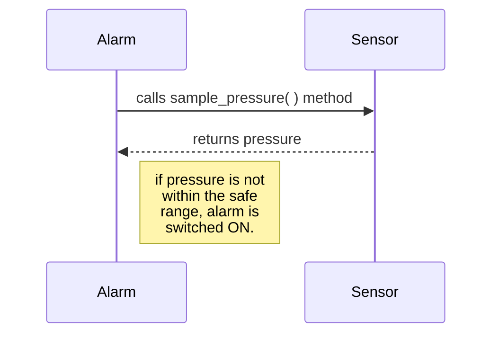

## STUB

Imagine the code for a racing car alert system where there is a need to alert the driver if the tire pressure is not within the safe threshold. 



```
from sensor import Sensor

class Alarm:
	def __init__(self):
		self._low_pressure_threshold = 17
		self._high_pressure_threshold = 21
		self._sensor = Sensor()	
		self.is_alarm_on = False
	
	def check(self):
		pressure = self._sensor.sample_pressure()
		if pressure < self._low_pressure_threshold or pressure > self._high_pressure_threshold :
			self.is_alarm_on = True
```

Now we would like to test the `check` method. It is rather inconvenient to use an actual tire pressure sensor. We would like to run our test without having a physical sensor. It would make more sense to substitute a test double instead of using a real sensor. 

Now, lets make it easy to substitute the sensor with a stub in the Alarm constructor by making the sensor an optional argument. Now the test can easily pass a sensor stub instance to the Alarm class. 

```
class Alarm:
	def __init__(self, sensor = None):
		self._low_pressure_threshold = 17
		self._high_pressure_threshold = 21
		self._sensor = sensor or Sensor()	
		self.is_alarm_on = False
```

Test module

```
from alarm import Alarm

def test_alarm_is_off_by_default():
	alarm = Alarm()
	assert not alarm.is_alarm_on
```

Now we will replace the real sensor with a stub sensor. It has the same methods as the actual sensor, but the implementation is going to be very simple and fully under the control of the test.

```
class StubSensor:
	def sample_pressure(self):
		return 15

def test_low_pressure_activates_alarm(self):
	alarm = Alarm(sensor=StubSensor())
	alarm.check()
	assert alarm.is_alarm_on
```

## Using `unittest.mock.Mock` as a stub

Lets add another test case for our `test_alarm` module. This time, we will stub using `unittest.mock.Mock` framework.

```
from sensor import Sensor

def test_normal_pressure_alarm_is_off():
	stubSensor = Mock(spec_set = Sensor)
	stubSensor.sample_pressure.return_value = 18
	alarm = Alarm(sensor=stubSensor)
	alarm.check()
	assert not alarm.is_alarm_on
```

We passed the class we wanted to replace with the test double as a value to `spec_set`argument in `Mock`. Here, `spec_set` argument is a stricter version of `spec`.  Attempting to _set_ or get an attribute on the mock that isn’t on the object passed as _spec_set_ will raise an `AttributeError`.
[https://docs.python.org/3/library/unittest.mock.html#unittest.mock.Mock](https://docs.python.org/3/library/unittest.mock.html#unittest.mock.Mock)

Most people say mock when they mean test double which can get a bit confusing. Because here we are calling a function called mock, but we are using the return value as a stub.

Like every other test double, the characteristics of a stub are - 
- They look the same as the real class on the outside. They have the same specifications.
- However, what is inside is pretty much nothing. In each test case, you set it up with a hard-coded response to the methods that the class under test is using.

Out of all kinds of test doubles, stub is almost the simplest. You use one when it is inconvenient to use the real collaborator object. The real object could be unreliable or difficult to construct or slow or access resources that are unavailable in a unit test.

## Fake

The following is the code to convert some text from a file into HTML.

```
import  html  as  html_converter

class HtmlPagesConverter

	def __init__(self, openFile):
		self.openFile = openFile	
		self._find_page_breaks()
	
	def _find_page_breaks(self):
		"""Read the file and note the positions of the page breaks so we can access them"""
	
		self.breaks = [0]
		while True:
			line = self.openFile.readline()
			if not line:	
				break
			if "PAGE_BREAK" in line:
				self.breaks.append(self.openFile.tell())
		self.breaks.append(f.tell())

	def get_html_page(self, page):			
		"""Return html page with the given number (zero indexed)"""

		pageStart = self.breaks[page]		
		pageEnd = self.breaks[page + 1]		
		html = ""
		self.openFile.seek(pageStart)
		while self.openFile.tell() != pageEnd :
			line = self.openFile.readline()
			if "PAGE_BREAK" in line :
				continue
			line = line.rstrip()
			html += html_converter.escape(line, quote=True)
			html += "<br />"
		return html
```

The method `get_html_page` will open a file, find the relevant part of it and then convert it into HTML. It would make sense to test this code without using an actual file. The `HtmlPagesConverter` is using a file as a collaborator. A file descriptor/open file has specifications like `readline`, `seek`, `tell` etc. We would like to replace the file collaborator with a test double. If we use a stub,  we would have to add stub implementations of all the file methods. In this case, it would be easier to use a fake.

In the python standard library, there is a class `StringIO`. It has all the methods as a file, but it is entirely in memory which is desirable for a unit test. It might not be possible to use it in the real production code since files can be too large and need to persist between runs of the program.

```
import io
from html_converter import HtmlPagesConverter

def test_access_second_page():
	fakeFile = io.StringIO("""\
page one
PAGE_BREAK
page two
PAGE_BREAK
page three 
"""
)

	converter = HtmlPagesConverter(open_file=fakeFile)
	convertedText = converter.get_html_page(1)
	assert converted_text == "page two<br />"
```
Like every test double, the characteristics of a fake are - 
- It looks good from the outside. They have the same methods as the class they are replacing.
- But unlike a stub, a fake has a realistic implementation with logic and behaviour inside it.

Similar to file, we can replace a database with a fast in-memory database or a real web server with a lightweight web server.

As we move from stub --> fake, we realise it is getting more similar to the collaborator being repaced.

## Mocks and Spies

Mocks and spies do everything that stubs do. They have the same methods that the object they replace. Like stubs, they return hard-coded values and have very little of their own behaviour. 

**Three kinds of assert** - 
- Return value or exception
- State change
- Method-call : You might want to ensure that the collaborating class received a method call with particular arguments. It is a more complex kind of assert than the other two and uses a mock or a spy.

Lets look at the following example. The `handle` method in `MyService` checks the presence of a single-sign-on token and returns a response accordingly.

    class Request:
        def __init__(self, name):
            self.name = name
    
    
    class Response:
        def __init__(self, text):
            self.text = text
    
    
    class MyService:
        def __init__(self, ssoRegistry):
            self.ssoRegistry = ssoRegistry
    
        def handle(self, request, ssoToken):
            if ssoToken:
                return Response(F"Hello {request.name}")
            else:
                return Response("Please sign in")

Lets also have the basic structure of `SingleSignOnRegistry` and `SSOToken`.

    class SingleSignOnRegistry:
        def is_valid(self, token):
            pass
    
    
    class SSOToken:
        def __init__(self):
            self.id = random.randrange(10000)

Now a simple test case would be : 

    def test_hello_name():
        service = MyService(None)
        response = service.handle(Request("Dishant"),SSOToken())
        assert response.text == "Hello Dishant"

Ideally, the `handle` method should also check if the token is valid using the `SSORegistry`. Lets write a test case for that.

    def test_handle_verifies_token():
        spyRegistry = Mock(spec_set=SingleSignOnRegistry)
        service = MyService(spyRegistry)
        token = SSOToken()
        service.handle(Request("Dishant"), token)
        assert spyRegistry.is_valid.assert_called_with(token)

Of, course this test would fail since we are not calling `is_valid` in the `handle` method. Lets add the implementation.

       def handle(self, request, ssoToken):
		    if self.ssoRegistry.is_valid(sso_token):
                return Response(F"Hello {request.name}")
            else:
                return Response("Please sign in")

But now the original test would be failing since `None` does not have any attribute `is_valid`. Lets fix our first test.

    def test_hello_name():
        stubRegistry = Mock(spec_set=SingleSignOnRegistry)
        service = MyService(stubRegistry)
        response = service.handle(Request("Dishant"), SSOToken())
        assert response.text == "Hello Dishant"

The `Mock` object has a property that if any method is called on `Mock`, it returns another `Mock` object which is not `None` or `False`. Hence, the token is considered valid and the test passes.

The reason why the `Mock` object is a stub in `test_hello_name` because it is not going to fail the assertion in the end. Whereas in `test_handle_verifies_token`, it is a spy since it has a call in the end which will check whether `is_valid` was called or not. 

Now we need add a test case for invalid token.

    def test_handle_invalid_token():
        spyRegistry = Mock(spec_set=SingleSignOnRegistry)
        spyRegistry.is_valid.return_value = False
        service = MyService(spyRegistry)
        token = SSOToken()
        response = service.handle(Request("Dishant"), token)
        assert response == "Please sign in"

We can consider the `spyRegister` as the spy listening in on how `MyService` is using its collaborator `ssoRegistry`. It records the methods it receives. 

So as with every test double, a spy also has the same methods as the object it replaces. In other aspects, it is actually similar to a stub or fake. It may return hard-coded values or may actually have some kind of implementation. The difference with a spy is that it records the methods that it receives so that we can make assertions about what happened afterwards. A spy is used to verify that interactions between objects is happening correctly. 

Lets write one more test case to strictly verify if the token was valid and this time use a `Mock`. 

```
def confirm_token(correctToken):
	def is_valid(actualToken):
		if actualToken != correctToken:
			raise ValueError("Wrong Token")
	return is_valid


def test_handle_and_is_valid_receives_correct_token():
	mockRegistry = Mock(spec_set=SingleSignOnRegistry)
	token = SSOToken()
    mockRegistry.is_valid = Mock(side_effect=confirmToken(token))
    service = MyService(mockRegistry)
    service.handle(Request("Dishant"), token)
    mockRegistry.is_valid.assert_called()
```

Suppose, in our implementation we pass an invalid token and then run the tests. The above test will fail in the second last line statement i.e the handle method whereas in the spy test, the stack trace points to the last assert statement.

The mockRegistry has the same methods as the class it is replacing but we have instrumented the `is_valid` method to throw an exception if the token is not valid. So a mock knows what method calls to expect and fails the test if there is anything incorrect about the call.

Like every test double, mock looks the same on the outside as the real class. Otherwise, what is inside is very much like a spy. The main difference is that a mock has expectations about what method will be called, with what arguments and will enforce those expectations as soon as it receives the wrong call. You don't have to wait for the test to run till the last statement. It will blow up straightaway. So you use mock when there is a need to test interactions between two objects and to have the test fail instantly as soon as any incorrect interaction takes place which leads you exactly to the point where it breaks.

A spy or mock could be a proxy or a wrapper around a fake or even a real implementation.

**End Note**

- Stubs and fakes are there to replace some kind of inconvenient collaborator.
- Spies and mocks are about ensuring correct interactions.
- You would want to pay attention to how many test doubles you need in a test. If you have got a lot of them, it can mean that the design is not quite right and there are too many collaborators. And your class probably has too many responsibilities and needs.

## Monkey Patching

Monkey patching is another name for meta-programming. It is when you dynamically change an attribute or a piece of code at runtime. You exchange the code that was there when the program started running with some other code and this can be a useful way to insert a test double.

The easiest way to inject test doubles is by passing them in the constructor but sometimes it is not possible to do so. In such cases, monkey-patching is like a back door to inject a test double.

Lets look at the original tire-pressure alarm example.

```
from sensor import Sensor

class Alarm:
	def __init__(self):
		self._low_pressure_threshold = 17
		self._high_pressure_threshold = 21
		self._sensor = Sensor()	
		self.is_alarm_on = False
	
	def check(self):
		pressure = self._sensor.sample_pressure()
		if pressure < self._low_pressure_threshold or pressure > self._high_pressure_threshold :
			self.is_alarm_on = True
```

Lets start with a simple test case.

```
from unittest.mock import patch
from sensor import Sensor

def test_alarm_with_high_pressure_value():
	with patch('alarm.Sensor') as testSensor:
		testSensorInstance = Mock(spec_set = Sensor)	
		testSensorInstance.sample_pressure.return_value = 22
		testSensor.return_value = testSensorInstance

		alarm = Alarm()
		alarm.check()	
	
		assert alarm.is_alarm_on	
```

We used monkey patch to replace the original `Sensor` class with a stub sensor class i.e `testSensor` in the above case. We stubbed it to return a `testSensorInstance` in our test case. 

Patch syntax --> `with patch(<module>.<stuffToBeReplaced>) as testDouble`

Patch with decorator syntax.

```
@patch('alarm.Sensor')
def test_alarm_with_low_pressure_value(testSensor):
	testSensorInstance = Mock(spec_set = Sensor)	
	testSensorInstance.sample_pressure.return_value = 16 
	testSensor.return_value = testSensorInstance

	alarm = Alarm()
	alarm.check()	
	
	assert alarm.is_alarm_on	
```

But in terms of good design, modifying the constructor of alarm would have been a better choice than monkey-patching. Monkey patching is a powerful technique but it can make tests harder to maintain and failures harder to understand.

The following is an example where monkey patching makes more sense to use. Consider the html conversion example. 

```
import  html  as  html_converter

class HtmlPagesConverter:

	def __init__(self, fileName):
		self.fileName = fileName	
	
	def __enter__(self):	
		self.openFile = open(self.fileName)
		self._find_page_breaks()
		return self

	def __exit__(self, *exc):
		return self.openFile.close()
```

A simple test case using monkey patching.

```
from unittest.mock import patch, mock_open
from html_pages import HtmlPagesConverter

@patch("builtins.open", new_callable=mock_open, read_data="quote: ' ")
def test_convert_quotes(fakeFile):
	with HtmlPagesConverter("filename.txt") as converter:
		convertedText = converter.get_html_page(0) 
		assert convertedText == "quote: &#x27;<br />"	
```

## When to use test double ? 

A unit test should test a single codepath through a single method. When the execution of a method passes outside of that method, into another object, and back again, you have a dependency. When you test that code path with the actual dependency, you are not unit testing; you are integration testing. While that's good and necessary, it isn't unit testing.

While having said that, Unit tests can and should exercise more than a single method, as long as it all belongs to the same cohesive unit. Doing otherwise would require way too much mocking/faking, leading to complicated and fragile tests. 

Suppose a method A calls method B and method C.

```
def A():
	B()
	C()
	return "something"
```

To write a unit test for the above method, you might need to stub the called methods B and C in the worst case if the test case depends on the return values of methods B and C. Otherwise, there is no good reason to replace the real implementation of B and C with a test double. Doing so means you will be testing the implementation and not the required result. Testing the implementation makes the test brittle and hinders refactoring. Rather in some cases, It might just make sense to test that B and C were called. 

Here's an example in pseudocode. 

```
// the correct way of testing
testSort() {
    testList = [1, 7, 3, 8, 2] 
    MySorter.sort(testList)

    assert testList equals [1, 2, 3, 7, 8]
}

// incorrect, testing implementation
testSort() {
    testList = [1, 7, 3, 8, 2] 
    MySorter.sort(testList)

    assert that compare(1, 2) was called once 
    assert that compare(1, 3) was not called 
    assert that compare(2, 3) was called once 
    ....
}
```

The incorrect way tests interactions even when it is not necessary. It is incorrect because you're testing that a particular requirement is implemented in a particular way, instead of that the implementation produced the required result.

Here is another example, 
```
testInvitations() {
   // train as stub
   pdfFormatter = create mock of PdfFormatter
   let pdfFormatter.getCanvasWidth() returns 100
   let pdfFormatter.getCanvasHeight() returns 300
   let pdfFormatter.addText(x, y, text) returns true 
   let pdfFormatter.drawLine(line) does nothing

   // train as mock
   mailServer = create mock of MailServer
   expect mailServer.sendMail() called exactly once

   // do the test
   sendInvitations(pdfFormatter, mailServer)

   assert that all pdfFormatter expectations are met
   assert that all mailServer expectations are met
}
```

In the above example, we train the `PdfFormatter` object  to quietly accept any call and return some sensible canned return values for all methods that `sendInvitation()` happens to call at this point. But what happens later, when we change `sendInvitations()`, or some other class that `sendInvitations()` uses, to create more fancy pdf's?. Our test suddenly fails because now more methods of `PdfFormatter` are called and we didn't train our stub to expect them. 

How to fix this ? 
- Try using real classes instead of mocks whenever possible.
- Try creating a simple test implementation of the interface instead of mocking it in each test, and use this test class in all your tests.

All in all, mock objects have their use, but when not used carefully, **they often encourage bad practices, testing implementation details, hinder refactoring and produce difficult to read and difficult to maintain tests**.

## References

- [https://enterprisecraftsmanship.com/posts/when-to-mock/](https://enterprisecraftsmanship.com/posts/when-to-mock/)
- [https://stackoverflow.com/questions/38181/when-should-i-mock](https://stackoverflow.com/questions/38181/when-should-i-mock)
<!--stackedit_data:
eyJoaXN0b3J5IjpbLTYyMjUwNzIxNV19
-->